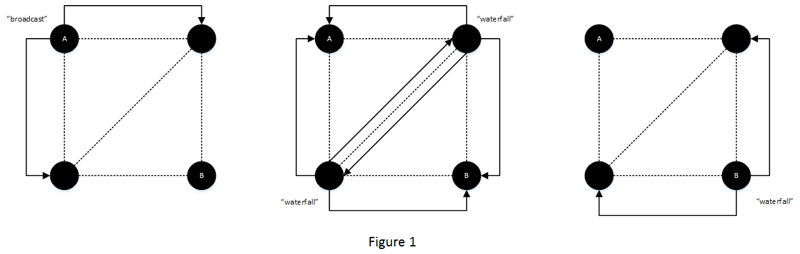

Documentation for individual implementations can be found in their respective folders.

Current build status:

[ ](https://app.shippable.com/projects/5750887b2a8192902e225466) [ ](https://travis-ci.org/gappleto97/p2p-project) [ ](https://ci.appveyor.com/project/gappleto97/p2p-project) [ ](https://codeclimate.com/github/gappleto97/p2p-project) [ ](https://codecov.io/gh/gappleto97/p2p-project)

[ ](https://waffle.io/gappleto97/p2p-project) [ ](https://waffle.io/gappleto97/p2p-project) [ ](https://waffle.io/gappleto97/p2p-project) [ ](https://waffle.io/gappleto97/p2p-project) 

# Mass Broadcast Protocol

1.  **Abstract**

     This project is meant to be a simple, portable peer-to-peer network. Part of its simplicity is that it will utilize no pathfinding or addressing structure outside of those provided by TCP/IP. This means that any message is either a direct transmission or a mass broadcast. This also makes it much simpler to translate the reference implementation into another language.

     It also is meant to be as modular as possible. If one wishes to operate on a different protocol or subnet, it takes one change to make this happen. If one wishes to use an encrypted communications channel, this is also relatively easy, so long as it inherits normal socket functions. If one wishes to compress information, this takes little change. If not, simply don't broadcast support.

     This proposal is meant to formally outline the structure of such a network and its various nodes, as well as communicate this approach's disadvantages.


2.  **Routing and Packet Structure**

     There are two layers to be concerned about in this network structure. The first is a pathfinding layer. This is the capsule in which all messages will be wrapped.

     The second is a messaging layer. This deals with how nodes are supposed to respond to various signals, whether the message is for mass broadcast, etc.

     Packets are arranged like so:

         Size of message    - 4 (big-endian) bytes defining the size of the message
         ------------------------All below may be compressed------------------------
         Size of packet 1   - 4 bytes defining the plaintext size of packet 1
         Size of packet 2   - 4 bytes defining the plaintext size of packet 2
         ...
         Size of packet n-1 - 4 bytes defining the plaintext size of packet n-1
         Size of packet n   - 4 bytes defining the plaintext size of packet n
         ---------------------------------End Header--------------------------------
         Pathfinding header - [broadcast, waterfall, whisper, renegotiate]
         Sender ID          - A base_58 SHA384-based ID for the sender
         Message ID         - A base_58 SHA384-based ID for the message packets
         Timestamp          - A base_58 unix UTC timestamp of initial broadcast
         Message packets
           Message header   - [broadcast, whisper, handshake, peers, request, response]
           Message contents

     ID construction is defined in section 6. In all other places where packet constructions are given, the header is not included.


3.  **Node Construction**

     A node consists of two threads. The first is strictly for user interaction. The second is for receiving and automated responses.

     A node also consists of several distinct parts.

     1. A routing table of peers with the IDs and corresponding connection objects
     2. A "waterfall queue" of recently received message IDs and timestamps
     3. A user-interactable queue of recently received messages
     4. An incoming socket object to deal with new peers
     5. A quantity-limited list of outgoing connections
     6. A "protocol", which contains:
         1. A sub-net flag
         2. An encryption method (or "Plaintext")
         3. A way to obtain a SHA256-based ID of this (defined later)


4.  **Connection Objects**

     A connection object *must* have the following properties (though it can have more).

     1. A way to send to the connected node
     2. A way to receive from the connected node
     3. A way to communicate with the main object
     4. The peer's ID
     5. A protocol definition
     6. A list of supported compression methods
     7. IF this list is not empty:
         * A way to renegotiate supported methods
         * A way to communicate when an error has occurred
     8. Methods to deal with pathfinding flags


5.  **Message Propagation**

     A message is initially broadcast with the `broadcast` flag. The broadcasting node, as well as all receivers, store this message's ID and timestamp in their waterfall queue. The reciving nodes then re-broadcast this message to each of their peers, but changing the flag to `waterfall`.

     A node which receives these waterfall packets goes through the following checks:

     1. If the message ID is not in the node's waterfall queue, continue and add it to the waterfall queue
     2. Perform cleanup on the waterfall queue
         1. Remove all possible duplicates (sending may be done in multiple threads, which may result in duplicate copies)
         2. Remove all IDs with a timestamp more than 1 minute ago
         3. Reduce the queue size to 100
     3. Re-broadcast this message to all peers

     An optional optimization of this process is to not waterfall to the original sender.

     


6.  **ID Constructions**

     1. Defining Base\_58

         The following python code defines base\_58 for the purposes of this program. This is derived from Bitcoin's base\_58, and is used to allow some compression over hex, while still maintaining human readability.

         ```python
         base_58 = '123456789ABCDEFGHJKLMNPQRSTUVWXYZabcdefghijkmnopqrstuvwxyz'

         def to_base_58(i):
             string = ""
             while i:
                 string = base_58[i % 58] + string
                 i = i // 58    # Floor division is needed to prevent floats
             return string.encode()

         def from_base_58(string):
             if isinstance(string, bytes):
                 string = string.decode()
             decimal = 0
             for char in string:
                 decimal = decimal * 58 + base_58.index(char)
             return decimal
         ```

     2. Protocol IDs

         A protocol ID is generated by the following example classes.

         The version is defined in the code itself. As of this document's last update the version is "0.1.C".

         python:

         ```python
         class protocol(namedtuple("protocol", ['subnet', 'encryption'])):
             @property
             def id(self):
                 info = [str(x) for x in self] + [version]
                 h = hashlib.sha256(''.join(info).encode())
                 return to_base_58(int(h.hexdigest(), 16))
         ```

         javascript:

         ```javascript
         class protocol {
             constructor(subnet, encryption) {
                 this.subnet = subnet;
                 this.encryption = encryption;
             }

             id() {
                 var info = [this.subnet, this.encryption, version];
                 var hash = SHA256(info.join(''));
                 return to_base_58(BigInt(hash, 16));
             }
         }
         ```

     3. Node IDs

         A node generates its ID by the following python pseudo-code, where this is called on the incoming connection, and the `user_salt` is a `uuid4`:

         ```python
         def get_id(self):
             info = [str(self.out_addr), self.protocol.id, user_salt]
             h = hashlib.sha384(''.join(info).encode())
             return to_base_58(int(h.hexdigest(), 16))
         ```

     4. Message IDs

         A message generates its ID by the following example class.

         ```python
         class message(namedtuple("message", ['packets'])):             
             @property
             def id(self):
                 payload_string = b''.join(self.packets[4:])
                 payload_hash = hashlib.sha384(payload_string + self.packets[3])
                 return to_base_58(int(payload_hash.hexdigest(), 16))
         ```

     5. Request/Response IDs (beta)

         A request ID is generated by the following python pseudo-code. This example assumes that you are trying to reply to a message, so it is called upon a message object, which contains a pointer to the protocol and server, as well as the raw message, timestamp, and either the ID or connection to the original sender, depending upon which is available.

         This section may be changed as the request/response mechanism is expanded upon.

         ```python
         request_info = peer_id + to_base_58(getUTC())
         request_hash = hashlib.sha384(request_info.encode())
         request_id = to_base_58(int(request_hash.hexdigest(), 16))
         ```


7.  **Handshake Exchanges**

     To connect to the messaging layer (and thus get announced to the rest of the network) you must make a handshake exchange with at least one connection to the network.

     In order to do so, you first make a connection to the receiving node. You and the recieving node then immediately broadcast two transactions to each other, the second only after verifying the first.

         1.  whisper
             [your id]
             [message id]
             [timestamp]
             handshake
             [your id]
             [your outward-facing address]
             [json-ized list of supported compression methods, in order of preference]

         2.  whisper
             [your id]
             [message id]
             [timestamp]
             peers
             [json-ized copy of your routing table in format: [[addr, port], id]]


8.  **Methods of Encryption**

     The network will support any communications object which extends a standard socket object. This ensures that it does not care whether it is stacked on top of TCP, TLS, or PKCS1\_v1.5-encrypted TCP. The reference implementation will use TCP or PKCS1\_v1.5-encrypted TCP. TLS will be included if I can figure out how to generate self-signed certificates in native python.


9.  **Asynchronous Requests** (beta)
 
     If you want to privately reply to a message where you are not directly connected to a sender, the following method can be used:

     First, you broadcast a message to the network containing the `request` subflag. This is constructed as follows:

         broadcast
         [your id]
         [message id]
         [timestamp]
         request
         [a unique, base_58 id you assign]
         [the id of the desired peer]

     Then you place this in a dictionary so you can watch when this is responded to. A peer who gets this will reply:

         broadcast
         [their id]
         [message id]
         [timestamp]
         response
         [the id you assigned]
         [address of desired peer in format: [[addr, port], id] ]

     When this is received, you remove the request from your dictionary, make a connection to the given address, and send the message.

     A special case is if a node requests `*`. In this case, a node receiving it should `broadcast` their routing table to the network using the standard `peers` subflag.

     Potential problems to overcome: This may break if you have a compression method in common, because the message in question is sent before you have completed a handshake. If you do not, things should be fine. Fix in progress.


10.	**Potential Flaws**

     The network has a few immediately obvious shortcomings.

     First, the maximum message size is 4,294,967,299 bytes (including compression and headers). It could well be that in the future there will be more data to send in a single message. But equally so, a present-day attacker could use this to halt essentially every connection on the network. A short-term solution would be to have a soft-defined limit, but as has been shown in other protocols, this can calcify over time and do damage.

     Second, in a worst case scenario, every node will receive a given message n-1 times, and each message will generate n^2 total broadcasts, where n is the number of connected nodes. In most larger cases this will not happen, as a given node will not be connected to everyone else. But in smaller networks this will be common, and in well-connected networks this could slow things down. This calls for optimization, and will need to be explored. For instance, not propagating to a peer you receive a message from reduces the number of total broadcasts to (n-1)^2.

     Thrid, there is quite a lot of extra data being sent. Using the default parameters, if you want to send a 4 character message it will be expanded to 175 characters. That's ~44x larger. If you want these differences to be negligble, you need to send messages on the order of 512 characters. Then there is only an increase of ~34% (0% with decent compression). This can be improved by reducing the size of the various IDs being sent, or making the packet headers shorter. Both of these have disadvantages, however.

     Results using opportunistic compression look roughly as follows (last updated in 0.2.1+build.95):

     For 4 characters...

         original  4
         plaintext 175  (4375%)
         lzma      228  (5700%)
         bz2       192  (4800%)
         gzip      163  (4075%)

     For 498 characters...

         original  498
         plaintext 669  (134.3%)
         lzma      552  (110.8%)
         bz2       533  (107.0%)
         gzip      471  (94.6%)

     Because the reference implementation supports all of these (except for lzma in python2), this means that the overhead will drop away after ~500 characters. Communications with other implementations may be slower than this, however.